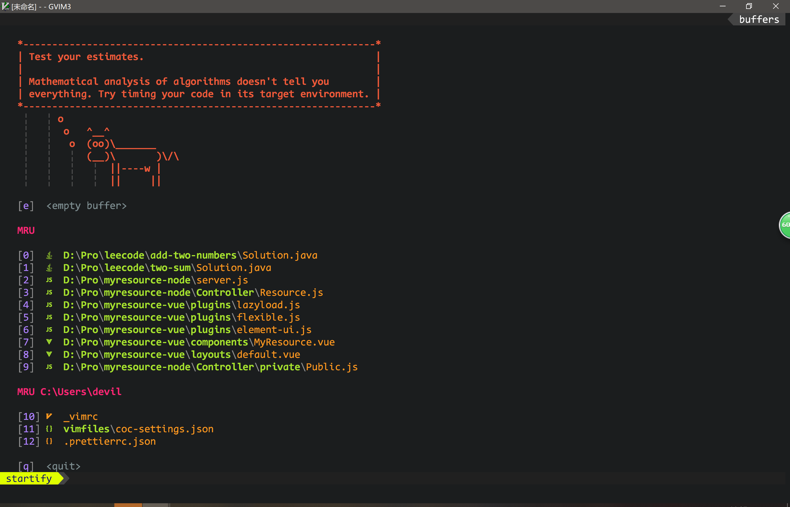
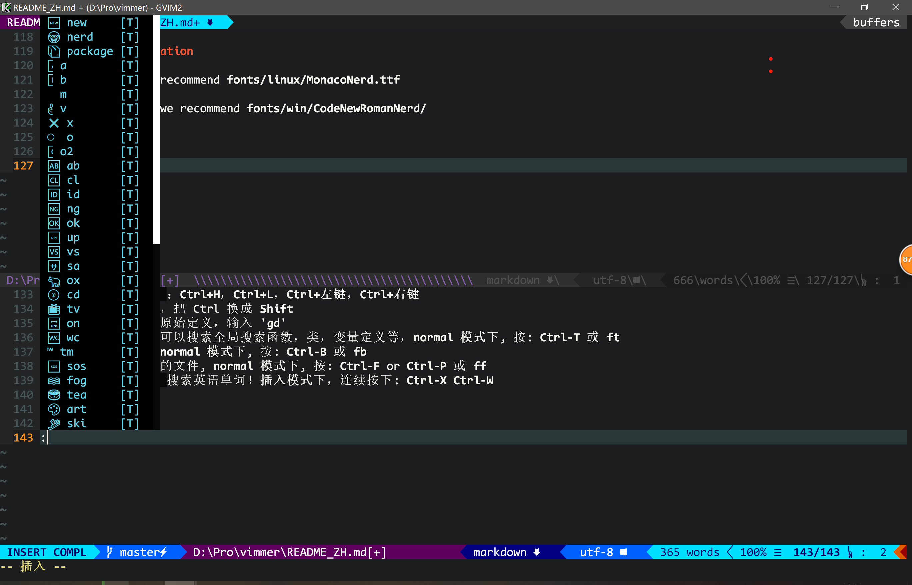
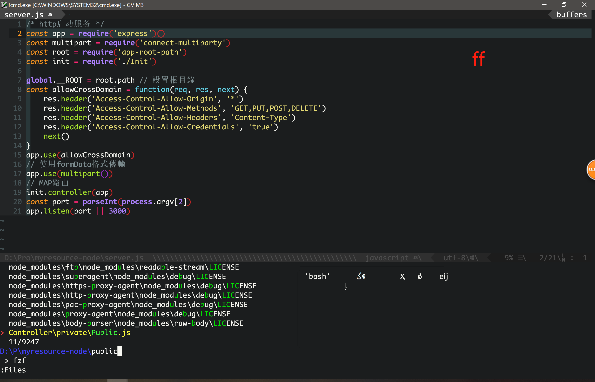
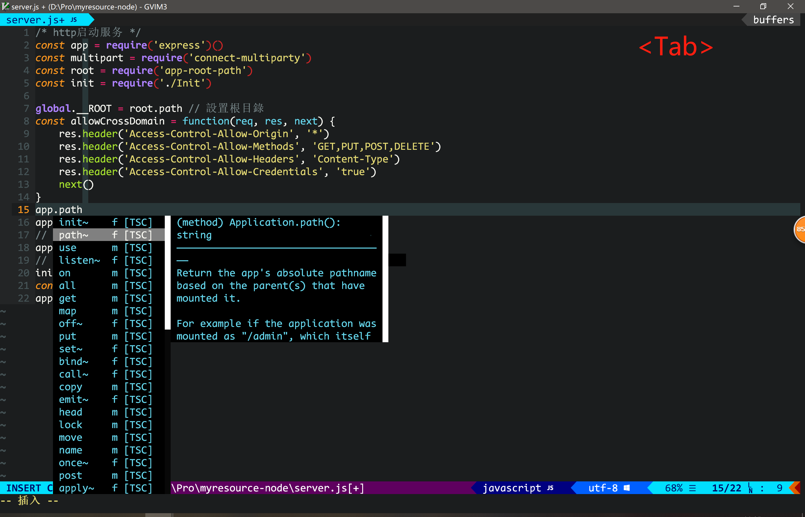
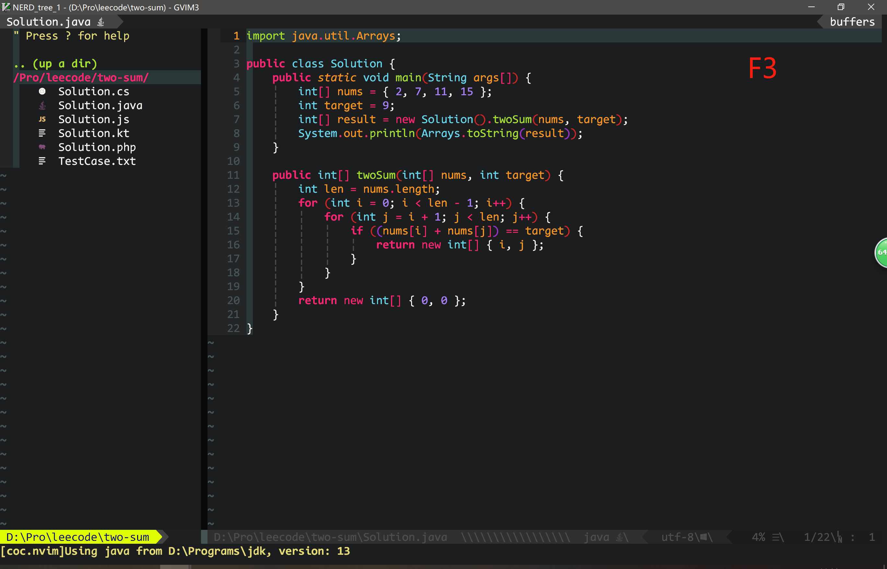
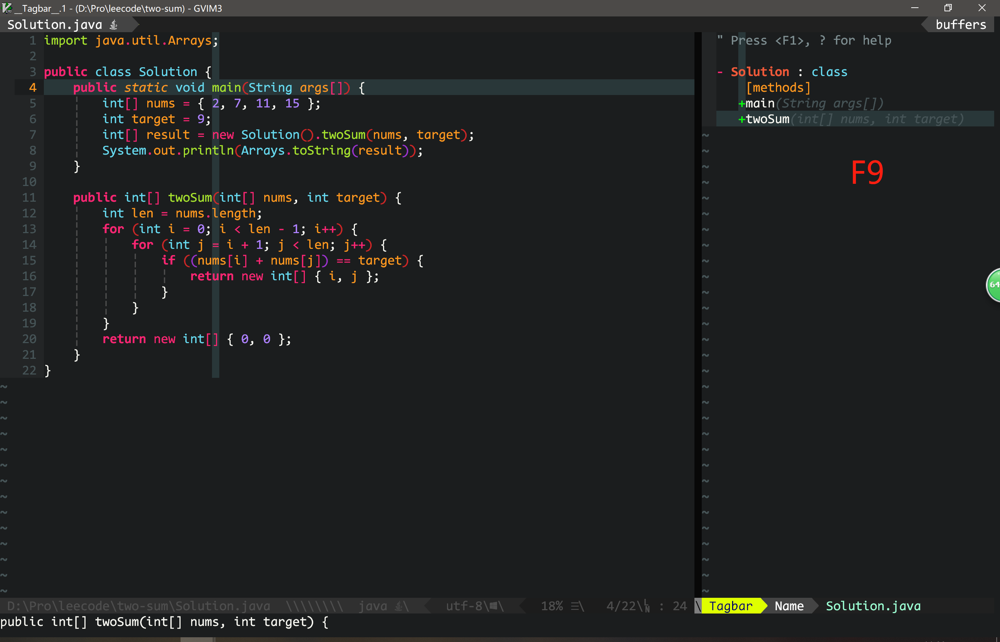
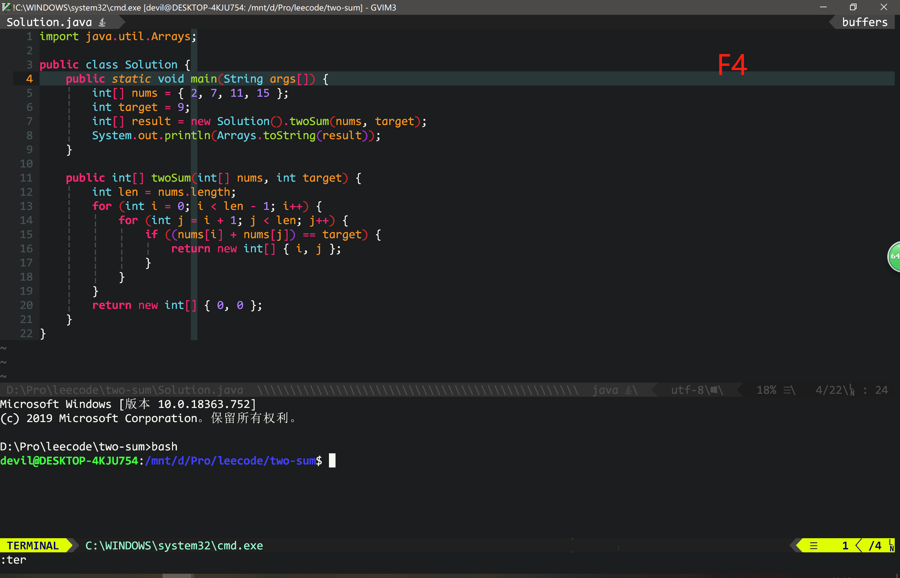
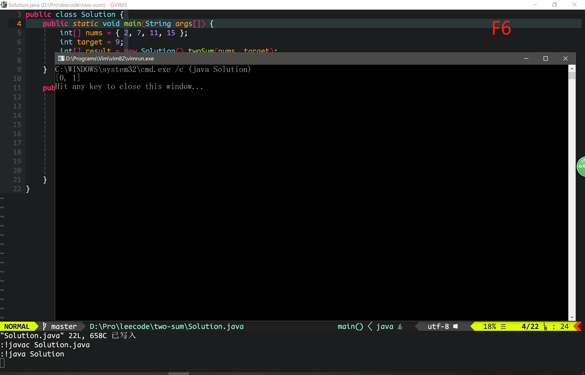
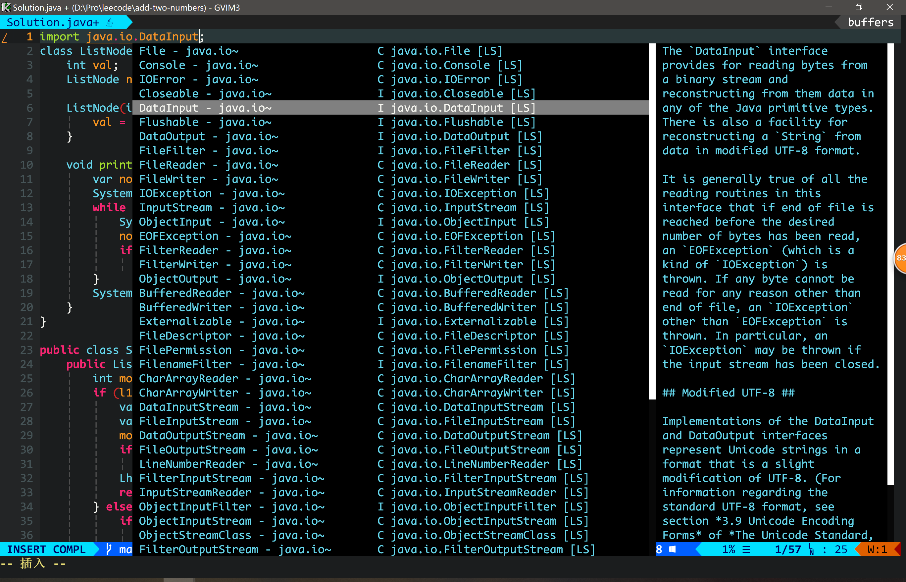
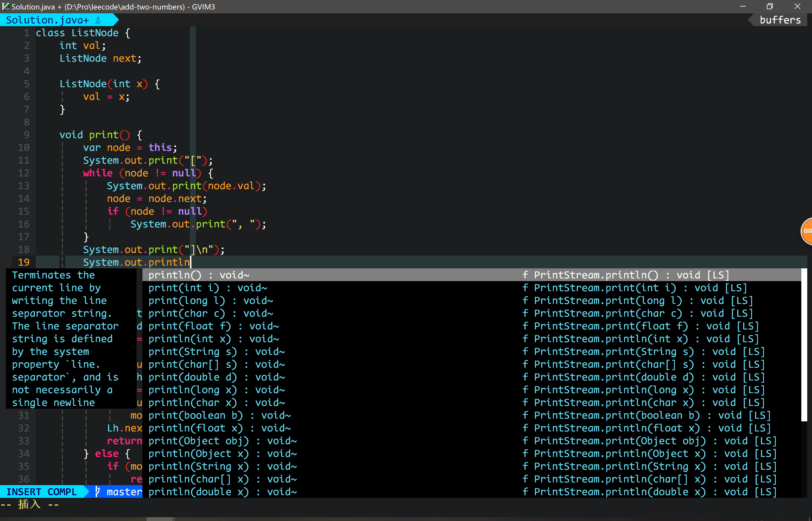

Windows **Gvim** 持续更新中......

# Vimmer

[English Readme](./README.md)

**精简而快速的 vim 配置**

一套超级强大而精简的 Vim/Gvim 配置，使你的 vim 具备 IDE 的功能

漂亮的 Monaco 字体，还有 nerd 补丁

全栈满足

## Linux 项目暂停更新

很抱歉，Vimmer 即将停止更新

未来，Linux 上，随着 NeoVim 壮大，Vimmer 也将被 NVimmer 替代，NVimmer 是基于 NeoVim 配置的。

请参考我的新版 Vimmer——NVimmer

[https://github.com/devilyouwei/NVimmer](https://github.com/devilyouwei/NVimmer)

该项目将会继续支持 Windows 上的 Gvim，因此只更新'\_vimrc'的配置

## 适用于

1. HTML CSS JS
2. Java
3. C# (移除，Windows 下请使用 Visual Studio)
4. vue
5. TypeScript
6. PHP
7. c/c++
8. Markdown
9. json
10. react jsx/tsx
11. kotlin (弱支持)
12. react jsx/tsx/js
13. emoji
14. English words 10k+

## 开始安装

### 安装 Gvim

安装 [Gvim](https://github.com/vim/vim-win32-installer/releases), 这个版本支持 Python, Lua, Ruby 等等。

建议安装 signed 版本！

### 克隆项目

```bash
git clone https://github.com/devilyouwei/Vimmer.git
```

### 基础配置

1.  复制 '.vimrc' 或 '\_vimrc' 到用户目录，Linux 是 '~/.vimrc', Windows 是 'c:\Users\用户名\\\_vimrc'
2.  复制 'vimfiles' 到 Windows 的用户目录下，里面已经包含了 'vim-plug' 插件
    Linux 执行如下命令安装 vim-plug

```bash
curl -fLo ~/.vim/autoload/plug.vim --create-dirs \
    https://raw.githubusercontent.com/junegunn/vim-plug/master/plug.vim
```

3.  复制 '.eslintrc.json' 和 '.prettierrc.json' 到用户目录，eslint 检查代码，prettier 可以格式化各种前端代码
4.  安装 nodejs，[https://nodejs.org](https://nodejs.org)
5.  安装字体，字体在 fonts 目录下，windows 直接移动字体到'C:\windows\Fonts\'，ubuntu 可以双击安装
6.  打开 vim 或 Windows gvim。使用`:PlugInstall` 命令安装所有插件

### 附加安装

JS 代码检查需要安装 eslint
（注意，如果项目目录下也有 eslintrc 或者 package.json 等配置文件，将会覆盖用户目录下的全局 eslint 配置文件，vim 将自动使用项目目录下的 eslint 配置，这很合理）

```bash
npm install -g eslint
```

Ubunut Linux 下安装 Ctags 和 Astyle

```
sudo apt install ctags
sudo apt install astyle
```

Windows 安装 Ctags 和 Astyle，全部需将 bin 或可执行文件目录添加到环境变量中，以便终端可以调用

-   [Ctags](http://ctags.sourceforge.net/)

-   [Astyle](https://sourceforge.net/projects/astyle/)

-   [Perl](http://strawberryperl.com/)

-   [Python](https://www.python.org/)

很简单吧，打开 vim👀 看看有什么不一样。

## 一些问题

-   Ubuntu 下没有 lua 的 vim 怎么办？安装 vim-nox

```bash
sudo apt install vim-nox
```

-   首次进入 gvim，由于报错，按键会被阻塞，无法做任何操作，请按下 Ctrl-C 取消，忽略所有错误，然后输入:PlugInstall 安装好插件，重启 gvim 即可正常使用

-   Java 无法自动补全和查错，因为 jdt.lsp 启动较慢，打开 java 文件后等一等即可

-   NerdTree 的字体乱码，这是因为没有安装 Nerd-font，参考[https://github.com/ryanoasis/nerd-fonts](https://github.com/ryanoasis/nerd-fonts)

Ubuntu 终端下，建议安装 fonts 下的 linux 下的 MonacoNerd.ttf

windows 暂时没有找到 nerd 补丁的 monaco，尝试手动制作，不是打不上补丁，就是 gvim 无法识别字体，所以使用 CodeNewRomanNerd 来代替，一样很好看，有办法弄到 MonacoNerd 在 windows gvim 下运行的童鞋帮忙 fork 添加一下，谢谢

Winodws gvim 下，建议安装 fonts 下的 win 下的 CodeNewRomanNerd

## 操作方法：

-   Emmet html 自动生成闭合 html 标签, 插入模式下按：**Ctrl-O** 参考'Emmet'官网用法
-   打开浮动终端: **F4**
-   保存: **F5**
-   保存并编译运行: **F6**
-   格式化代码：**F12**
-   清除空行: **F2**
-   打开当前目录文件树: **F3**
-   打开 Tagbar: **F9** (需要 ctags)
-   自动补全：Coc 自动补全插件，按 **Tab** 键可以自动补全
-   buffer 之间切换：**Ctrl+H**，**Ctrl+L**，**Ctrl+左键**，**Ctrl+右键**
-   Tab 切换：同上，把 Ctrl 换成 **Shift**
-   寻找函数，类的原始定义，输入 **'gd'**
-   标签全局搜索，可以搜索全局搜索函数，类，变量定义等，**normal 模式**下, 按: **Ctrl-T** 或 **ft**
-   搜索 buffers, **normal 模式**下, 按: **Ctrl-B** 或 **fb**
-   搜索当前路径下的文件, **normal 模式**下, 按: **Ctrl-F** or **Ctrl-P** 或 **ff**
-   **[new]** 在 vim 下搜索英语单词！**插入模式**下，连续按下: **Ctrl-X** **Ctrl-W**

## 字体推荐

**Linux Vim**, 推荐 **fonts/linux/MonacoNerd.ttf**

**Windows Gvim**, 推荐 **fonts/win/CodeNewRomanNerd/**

## Examples




















